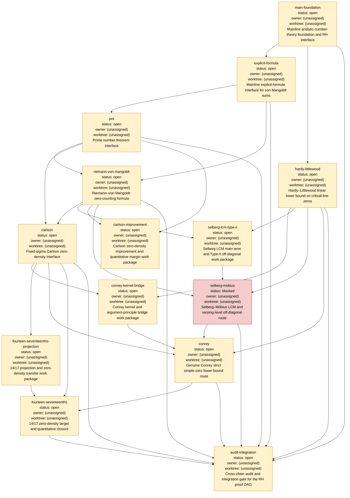

# Proof DAG

_Generated from proof-dag.yaml by scripts/dag_status.sh; edit the manifest and regenerate this file._

## Snapshot

- Validation: `ok`
- Nodes: `14`
- Dependency edges: `33`
- Status counts: `open=13`, `claimed=0`, `blocked=1`, `verified=0`
- Manifest version: `1`
- Generated from: `docs/superpowers/specs/2026-09-06-local-proof-dag-coordination-design.md`

> Warning: branch and worktree names are execution metadata. They identify the current coordination context; they are not proof evidence or theorem status.

## Operating instructions

1. Treat `proof-dag.yaml` as the canonical state; do not edit this generated snapshot directly.
2. Inspect the current state with `scripts/dag_status.sh proof-dag.yaml`.
3. Regenerate this view after a validated manifest change with `scripts/dag_status.sh --write DAG.md proof-dag.yaml`.
4. An open node is claimable only when every dependency is `verified`; a verified node requires named acceptance evidence.

## Status legend

The node colors correspond to the manifest status: `open`, `claimed`, `blocked`, and `verified`.

## Graph

