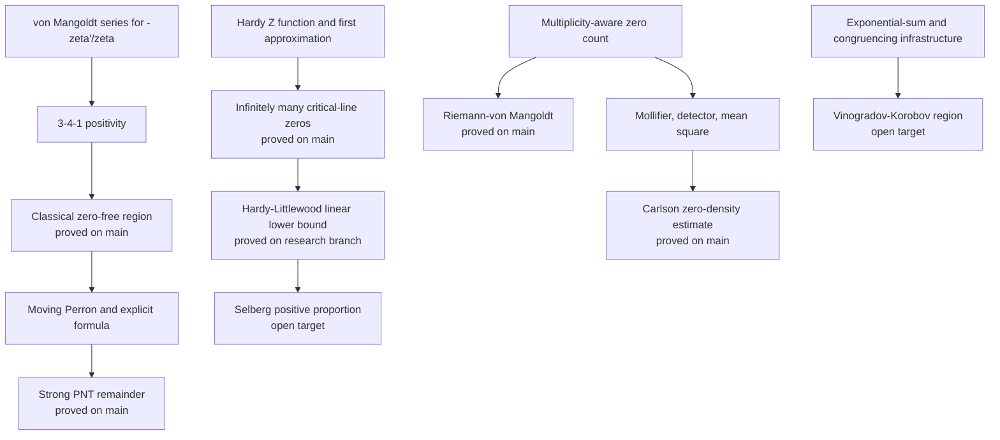

# Lean 4 中黎曼 zeta 函数的形式化解析数论

## Formalized Analytic Number Theory for the Riemann Zeta Function in Lean 4

本项目使用 Lean 4 和 Mathlib，对素数定理、Riemann zeta 函数零点及其定量分布中的
一组经典解析数论定理进行机械验证。

当前 `main` 分支已经包含经典零自由区域、Strong PNT、Hardy 定理、全高度
Riemann--von Mangoldt 零点计数公式、固定 `sigma` 的 Carlson 零密度估计，以及
Carneiro--Littmann 局部分离 Hilbert 不等式。项目没有证明 Riemann 假设。

> **状态边界：** 本页把 `main` 已验证定理、研究分支结果和开放目标分开列出。
> `def ... : Prop`、条件接口或研究路线不会被计作已经证明的数学定理。

---

## 写给非数学专业读者

### 为什么研究素数？

素数是只能被 `1` 和自身整除的正整数，例如 `2, 3, 5, 7, 11`。每个大于 `1` 的
整数都能唯一分解成素数的乘积，因此素数常被称为整数的“基本粒子”。

素数并不是按照固定间隔出现的。数得越大，素数整体上越稀疏，但局部位置仍然很难预测。
如果用 `pi(x)` 表示不超过 `x` 的素数个数，素数定理给出的第一层规律是：

```text
pi(x) 约等于 x / log(x).
```

这说明素数的平均密度大约是 `1 / log(x)`。但“约等于”还没有告诉我们误差究竟有多大。
解析数论的许多深层问题都在研究这个误差。

进一步阅读：

- [项目中的素数定理与误差项](docs/mathematical-contributions.md)
- [经典零自由区域证明链](docs/zero-free-region-chain.md)
- [显式公式证明链](docs/explicit-formula-chain.md)

### zeta 函数为什么会出现？

Riemann zeta 函数最初可以写成：

```text
zeta(s) = 1 + 1/2^s + 1/3^s + 1/4^s + ...
```

Euler 发现它还可以分解为所有素数的乘积。这个恒等式把一个复变量函数和全部素数同时
连接起来。经过解析延拓后，zeta 函数可以在几乎整个复平面上研究。

zeta 函数的非平凡零点通常写成：

```text
rho = beta + i*gamma.
```

在素数的显式公式中，零点会产生类似 `x^rho / rho` 的振荡项。直观地说：

- `beta` 控制振幅随 `x` 增长的尺度；
- `gamma` 控制关于 `log(x)` 的振荡频率；
- 零点的解析重数控制该项出现多少次。

因此，零点离复平面右边界有多远，会直接影响我们能多精确地预测素数分布。

进一步阅读：

- [Mathlib 的 Riemann zeta 定义与函数方程](https://leanprover-community.github.io/mathlib4_docs/Mathlib/NumberTheory/LSeries/RiemannZeta.html)
- [乘重数显式公式链](docs/explicit-formula-chain.md)
- [Riemann--von Mangoldt 零点计数公式](docs/riemann-von-mangoldt-chain.md)

### Riemann 假设位于哪里？

所有非平凡零点都位于 `0 < beta < 1` 的临界带中。Riemann 假设断言它们全部满足：

```text
beta = 1/2.
```

如果 RH 成立，素数计数误差将具有接近平方根的自然尺度。本项目形式化了 RH 与若干
经典误差估计之间的正反向联系，但这只是“如果且仅如果”的等价定理，并没有构造 RH
的证明。

当前无条件结果仍允许零点位于临界线之外，只是通过零自由区域和零密度估计限制它们
能够出现的位置和数量。

进一步阅读：

- [Clay Mathematics Institute: Riemann Hypothesis](https://www.claymath.org/millennium/riemann-hypothesis/)
- [RH 与素数误差等价链](docs/rh-error-equivalence-chain.md)
- [Carlson 零密度估计](docs/carlson-zero-density-chain.md)

### Lean 形式化增加了什么？

普通数学论文由专家阅读和审查。Lean 形式化进一步要求每个定义、假设和推理步骤都被
翻译成可由小型可信内核检查的证明项。

这并不自动产生新的数学定理，也不能把一个猜想变成证明。它的价值在于：

1. 暴露隐含假设、边界条件和重数约定；
2. 让长证明链的模块依赖可以被机器重复检查；
3. 区分真正的 theorem、条件接口和仅用于规划的 `Prop` 目标；
4. 为后续形式化零密度、临界线零点和更强误差估计提供可复用基础设施。

项目坚持一个简单原则：**只有 Lean 内核实际检查过的定理，才会在这里写成已证明。**

---

## English Summary

This repository develops a Lean 4 formalization of classical analytic number
theory surrounding the Riemann zeta function. Built on Mathlib, the verified
`main` branch includes the classical de la Vallee Poussin zero-free region,
the Prime Number Theorem with the classical exponential remainder, Hardy's
theorem on infinitely many critical-line zeros, an all-height
Riemann--von Mangoldt zero-counting formula, Carlson's fixed-`sigma`
zero-density estimate, and local-separation Hilbert and exponential
mean-square inequalities obtained from a concrete Carneiro--Littmann extremal
profile.

The development emphasizes multiplicity-aware zero counting, explicit-formula
contours, reusable analytic interfaces, focused theorem contracts, and axiom
audits. Research branches additionally contain a formal Hardy--Littlewood
linear lower bound and substantial infrastructure toward Selberg,
Vinogradov--Korobov, Pintz-style oscillation, and Weil-criterion routes; these
are reported separately from the merged theorem surface.

The project does **not** prove the Riemann Hypothesis, the
Vinogradov--Korobov zero-free region, Selberg's positive-proportion theorem,
or numerically explicit final constants. Classical mathematical theorems are
not presented as new results; the contribution is their machine-checked Lean
formalization, the proof architecture required to connect them, and the
resulting reusable library.

---

## 已在 `main` 验证的核心成果

下表只列出已经合并到 `main` 的 theorem-level 结果。

| 数学结论 | Lean 定理 | 源码与说明 |
|---|---|---|
| 经典 `c / log |t|` 零自由区域 | `ZeroFreeRegion.classical_zero_free_region_proved` | [源码](ZeroFreeRegion/PhragmenLindelofZeta.lean) · [证明链](docs/zero-free-region-chain.md) |
| 普通 PNT | `PrimeNumberTheorem.PNTForm3_proved` | [源码](PrimeNumberTheorem/PNTFromDynamicPerron.lean) · [数学贡献](docs/mathematical-contributions.md) |
| Chebyshev `psi` 的经典 Strong PNT 误差 | `PrimeNumberTheorem.exists_abs_chebyshevPsi_sub_id_le_exp_neg_sqrt_log` | [源码](PrimeNumberTheorem/ClassicalPNTError.lean) · [显式公式链](docs/explicit-formula-chain.md) |
| `pi(x) - Li(x)` 的经典误差 | `PrimeNumberTheorem.exists_abs_primeCounting_sub_logIntegral_le_exp_neg_sqrt_log` | [源码](PrimeNumberTheorem/ClassicalPrimeCountingError.lean) · [数学贡献](docs/mathematical-contributions.md) |
| Hardy 临界线无穷零点定理 | `HardyTheorem.hardy_theorem_target_proved` | [源码](HardyTheorem/HardyIntegralContradiction.lean) · [证明链](docs/hardy-theorem-chain.md) |
| 全高度 Riemann--von Mangoldt 公式 | `PrimeNumberTheorem.RiemannVonMangoldt.exists_abs_riemannZeroCount_sub_mainTerm_le_log` | [源码](PrimeNumberTheorem/RiemannVonMangoldt/AllHeightAsymptotic.lean) · [证明链](docs/riemann-von-mangoldt-chain.md) |
| 固定 `sigma` 的 Carlson 零密度估计 | `PrimeNumberTheorem.CarlsonZeroDensity.carlson_zeroDensity_isBigO` | [源码](PrimeNumberTheorem/CarlsonAsymptotic.lean) · [证明链](docs/carlson-zero-density-chain.md) |
| 局部分离加权 Hilbert 界 | `PrimeNumberTheorem.DirichletPolynomial.hilbertForm_norm_le_two_pi_localSeparation_carneiroLittmann` | [源码](PrimeNumberTheorem/CarneiroLittmannProfile.lean) · [证明链](docs/local-separation-hilbert-chain.md) |
| 局部分离指数和均方估计 | `PrimeNumberTheorem.DirichletPolynomial.finiteExponentialSum_meanSquare_le_localSeparation` | [源码](PrimeNumberTheorem/CarneiroLittmannProfile.lean) · [证明链](docs/local-separation-hilbert-chain.md) |

完整的声明级清单见
[Formal Theorem Inventory](docs/formal-theorem-inventory.md)。各条证明链的数学解释和
模块索引见本页末尾的“深入阅读”。

---

## 这些结果具体意味着什么？

### 1. 经典零自由区域与 Strong PNT

项目证明存在正常数 `c`，使充分大高度上的 zeta 零点不能进入区域：

```text
Re(s) >= 1 - c / log |Im(s)|.
```

证明路线包括 `-zeta'/zeta` 的 von Mangoldt 展开、`3-4-1` 三角恒等式、
Phragmen--Lindelof 增长、Jensen/Borel--Caratheodory 零点分解，以及候选零点排斥。

将该区域接入乘重数显式公式和移动高度 Perron 公式，得到：

```text
psi(x) - x = O(x * exp(-c * sqrt(log x))),

pi(x) - Li(x) = O(x * exp(-c' * sqrt(log x))).
```

这里的常数由存在量词给出；项目没有宣称得到 `1 / (4.896 log t)` 一类数值显式区域。

### 2. Hardy 定理

Hardy 定理说明 zeta 函数在临界线 `Re(s) = 1/2` 上有无穷多个零点。

形式化证明把临界线上的 zeta 转化为实值 Hardy `Z` 函数，对比带符号积分与绝对值积分，
再用第一 zeta 近似、Gamma 相位和非平稳振荡积分得到矛盾。

该结论比 RH 弱得多：它只保证临界线上有无穷多个零点，不保证所有零点都在那里。

### 3. Riemann--von Mangoldt 公式

令 `N(T)` 按解析重数统计高度不超过 `T` 的非平凡零点。项目证明：

```text
N(T) = T/(2*pi) * log(T/(2*pi)) - T/(2*pi) + O(log T).
```

这给出全部非平凡零点的 `T log T` 级总体规模，并为临界线计数、零密度估计和显式公式
提供统一的数据层。

### 4. Carlson 零密度估计

令 `N(sigma,T)` 按重数统计 `Re(rho) >= sigma`、`0 < Im(rho) <= T` 的零点。
对每个固定 `1/2 < sigma < 1`，项目证明：

```text
N(sigma,T)
  = O(T^(4*sigma*(1-sigma)) * (log T)^4).
```

这不是零自由区域：它允许该区域有零点，但证明靠近右侧的零点不能太多。
它也不是 RH，因为 RH 要求所有非平凡零点精确位于 `sigma = 1/2`。

### 5. 局部分离 Hilbert 工具

项目形式化了 Carneiro--Littmann 单调极值函数，并在 Lean 中闭合了 Fourier certificate。
最终估计让每个频率使用自己的局部间距，而不是只使用全局最小间距。

这套工具适用于 Dirichlet 多项式和指数和均方问题。它是可复用的解析基础设施，
但不会自动产生更强的 Carlson、Selberg 或 RH 结论。

### 6. RH 误差等价

仓库还证明了 RH 与经典平方根尺度 `psi` 误差之间的等价：

```lean
PrimeNumberTheorem.ExplicitFormulaResidues
  .riemannHypothesis_iff_RH_PsiErrorBound
```

以及 RH 与最优 `pi(x) - Li(x)` 误差之间的 von Koch 型等价。相关源码位于
[RHNaturalPsiError.lean](PrimeNumberTheorem/RHNaturalPsiError.lean) 和
[RHPrimeCountingConverse.lean](PrimeNumberTheorem/RHPrimeCountingConverse.lean)。

等价定理的逻辑形式是 `RH <-> error bound`。它没有证明等价式的任一开放命题为真。

---

## 证明架构



三条已经闭合的主链分别回答：

- 零点不能太靠近 `Re(s) = 1` 时，素数误差能有多小；
- 临界线上至少存在多少零点；
- 全部零点和靠右零点分别有多少。

VK、Selberg 和 Pintz 路线需要新的上游估计，不能由当前已证明定理自动推出。

---

## 活跃研究分支

以下结果不属于当前 `main` 的公开定理面。

| 分支或 PR | 当前进展 | 尚未闭合的边界 |
|---|---|---|
| [`research/hardy-littlewood`](https://github.com/cc-chen-tech/riemann-pnt-lean4/tree/research/hardy-littlewood) | 已证明 `hardy_littlewood_lower_bound_target_proved` 和奇重数强化版；Selberg 工作已完成 lag/Fourier/Hardy 相位模块，构造经典 `zeta^(-1/2)` 系数，并证明低区间恒等式、有限 zeta 截断乘 mollifier 平方到 collected/sliding 多项式的精确桥、实际有限低区间系数的统一 `(15/4)H^2` 能量界，以及完整短多项式均方到显式 frequency-gap sum 的归约 | Selberg `T log T` 下界仍是目标；还需控制高区间能量和 off-diagonal gap sum，建立 sqrt-zeta mollifier 的一致范数/余项估计，并把同一 mollifier 接到两个坏窗口测度层 |
| [PR #11: Pintz envelope](https://github.com/cc-chen-tech/riemann-pnt-lean4/pull/11) | 零点 envelope、单调性和经典 `sqrt(log x)` 下界 | 尚无到 `psi` 或 `pi-Li` 振荡/最大阶的桥 |
| 本地分支 `feat/vinogradov-korobov-exponential-sums` | 差分、矩阵、秩分层和同余系统等指数和基础设施；该分支尚未推送到 `origin` | `vinogradov_korobov_zero_free_region` 仍是 `def ... : Prop` |
| [Draft PR #8](https://github.com/cc-chen-tech/riemann-pnt-lean4/pull/8) | 平滑误差、有限零点簇振荡和有限 Weil certificate | 显式公式仍有 uncontrolled remainder，Weil 路线仍缺无限维桥 |

研究分支会快速变化。引用其中结果前，应记录 branch commit，重新运行定向 contract，
并检查它是否已经重基或合并到当前 `main`。

---

## 明确没有证明的内容

本仓库当前没有证明：

- Riemann 假设；
- Vinogradov--Korobov 零自由区域；
- 无条件平方根尺度素数误差；
- Selberg 的临界线零点正比例定理；
- Conrey 的百分比定理；
- Pintz 的均值阶或最大阶振荡定理；
- 带最终数值常数的显式 Strong PNT 或零自由区域。

这些名称可能出现在 `def ... : Prop`、条件闭合定理或研究分支中。出现一个目标声明并不等于
该目标已被证明。项目的声明分类规则见
[Implementation Standards](docs/implementation-standards.md) 和
[Target Statements and Chains](docs/target-statements-and-chains.md)。

---

## 论文与创新定位

### 已接近可整理的论文包

**零点计数与零密度的 Lean 4 形式化**

建议核心：

- 全高度 Riemann--von Mangoldt 公式；
- 乘重数零点数据层；
- Littlewood/Jensen 计数；
- Carlson 固定 `sigma` 零密度；
- 局部分离 Hilbert--Montgomery--Vaughan 工具。

这一组核心定理已经位于 `main`，适合面向形式化数学、交互式定理证明和自动推理社区。

### 集成后可整理的论文包

**Hardy 与 Hardy--Littlewood 临界线零点定理的 Lean 4 形式化**

建议核心：

- Hardy 临界线无穷零点定理；
- 临界线不同零点的线性下界；
- 奇重数临界线零点的线性下界；
- 短窗口积分、符号变化、测度控制与 packing。

在论文宣称这一成果前，必须先完成 Hardy--Littlewood 分支集成和最新全量 axiom audit。

### 长期独立方向

- Selberg 正比例：若完成 `N_0(T) >= c T log T`，会显著增强临界线论文；
- Vinogradov--Korobov：指数和基础设施和最终 zeta 零自由区域应单独成文；
- Pintz/零点迫使振荡：需要把零点 envelope 接入素数误差；
- Weil criterion：需要从有限证书过渡到完整函数空间和无限维正性。

### 创新边界

Riemann--von Mangoldt、Hardy、Carlson 和 Hilbert 型不等式都是经典数学定理。
本项目的论文贡献应表述为：

- 在 Lean 4 中完成可内核检查的形式化；
- 建立乘重数、轮廓积分、零点区域计数和定量渐近的接口；
- 将传统证明拆成可复用、可审计、可继续扩展的模块；
- 记录形式化迫使显式处理的边界条件和证明架构。

在完成更广泛 prior-art 核查前，不应使用“first formalization”作为无保留标题声明。

---

## 构建与复现

### 工具链

- Lean: `leanprover/lean4:v4.29.1`
- 构建系统: Lake
- 基础库: Mathlib

当前 `lakefile.lean` 使用本地路径依赖：

```lean
require mathlib from "./vendor/mathlib"
```

因此新克隆需要在 `vendor/mathlib` 放置与 Lean 4.29.1 匹配的 Mathlib checkout，
或者在发布工件中恢复为固定 commit 的 Git 依赖。详情见
[Publishing Readiness](PUBLISHING.md)。

### 全量构建

```bash
lake build
```

### 核心结果定向构建

```bash
lake build \
  Test.ClassicalPNTErrorContract \
  Test.ClassicalPrimeCountingErrorContract \
  Test.HardyFirstApproximationContract \
  Test.RiemannVonMangoldtAllHeightAsymptoticContract \
  Test.CarlsonAsymptoticContract \
  Test.CarneiroLittmannProfileContract
```

### 发布前检查

```bash
./scripts/verify-baseline.sh
python3 -m pytest
python3 scripts/list-prop-targets.py
```

最终定理的 contract 使用 `#check` 和 `#print axioms`。项目允许标准 Lean/Mathlib
逻辑基础，例如 `propext`、`Classical.choice` 和 `Quot.sound`；项目自定义 axiom、
`sorry` 或 `admit` 不属于可发布证明面。

不要把“源码扫描通过”“定向 contract 通过”和“全量 `lake build` 通过”压缩成同一个状态。
论文 artifact 应记录每个检查的命令、commit 和日期。

---

## 深入阅读

### 面向数学读者

- [数学贡献总览](docs/mathematical-contributions.md)
- [经典零自由区域证明链](docs/zero-free-region-chain.md)
- [乘重数显式公式链](docs/explicit-formula-chain.md)
- [Hardy 定理证明链](docs/hardy-theorem-chain.md)
- [Riemann--von Mangoldt 零点计数](docs/riemann-von-mangoldt-chain.md)
- [Carlson 零密度估计](docs/carlson-zero-density-chain.md)
- [局部分离 Hilbert 不等式](docs/local-separation-hilbert-chain.md)
- [RH 误差等价链](docs/rh-error-equivalence-chain.md)

### 面向形式化审稿人和贡献者

- [正式定理清单](docs/formal-theorem-inventory.md)
- [目标声明与缺口分类](docs/target-statements-and-chains.md)
- [剩余证明链索引](docs/missing-chains-index.md)
- [实现与声明标准](docs/implementation-standards.md)
- [发布准备检查](PUBLISHING.md)

### 可视化入口

- [Riemann proof atlas](docs/assets/riemann-proof-atlas.html)

---

## 代码结构

```text
ZeroFreeRegion/
  classical zero-free region, zeta growth, Jensen/Borel machinery

PrimeNumberTheorem/
  Perron and explicit formulas, PNT errors, RH equivalences,
  Riemann-von Mangoldt, zero density, Hilbert/mean-square tools

HardyTheorem/
  Hardy Z function, first zeta approximation, oscillatory integrals,
  critical-line zero arguments

MathlibAux/
  reusable analysis and finite-sum infrastructure not yet in Mathlib

Test/
  focused theorem contracts and axiom audits

docs/
  proof-chain explanations, theorem inventories, publication material
```

---

## Related Work

本项目不是第一个 PNT 形式化，也不应这样宣传。最低比较集合包括：

- [Math Inc. strongpnt](https://github.com/math-inc/strongpnt)：Lean 4 Strong PNT；
- [PrimeNumberTheoremAnd](https://github.com/AlexKontorovich/PrimeNumberTheoremAnd)：Lean 4 中的 PNT 及相关解析数论路线；
- [John Harrison, Formalizing an Analytic Proof of the Prime Number Theorem](https://www.cl.cam.ac.uk/~jrh13/papers/mikefest.html)：HOL Light 中的 Newman's analytic PNT；
- [Eberl--Paulson, The Prime Number Theorem](https://www.isa-afp.org/browser_info/current/AFP/Prime_Number_Theorem/document.pdf)：Isabelle/HOL PNT；
- [Loeffler--Stoll, Formalizing zeta and L-functions in Lean](https://arxiv.org/abs/2503.00959)：Mathlib zeta/L-function 基础；
- [Mathlib ZetaZeros](https://leanprover-community.github.io/mathlib4_docs/Mathlib/NumberTheory/LSeries/ZetaZeros.html)：zeta 零点离散性和紧集有限性；
- [Carneiro--Littmann, Monotone extremal functions and the weighted Hilbert's inequality](https://doi.org/10.4171/PM/2109)：局部分离极值核的数学来源。

正式投稿前还应重新检索当时最新的 Lean、Isabelle、HOL Light、Coq 和 Mizar 工作，
并邀请相关领域研究者核对历史优先权。

---

## Citation

如果在研究中使用本仓库，请引用对应 release commit。当前软件引用格式为：

```bibtex
@software{riemann_pnt_lean4,
  title  = {Formalized Analytic Number Theory for the Riemann Zeta Function in Lean 4},
  year   = {2026},
  url    = {https://github.com/cc-chen-tech/riemann-pnt-lean4}
}
```

论文作者、论文标题、arXiv 标识或 DOI 确定后，再增加独立论文条目；本 README 不预填
尚未确定的作者和出版信息。

## License

Apache 2.0，与 Mathlib 兼容。
