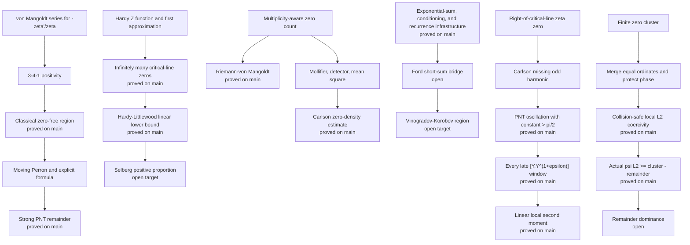

# Lean 4 中黎曼 zeta 函数的形式化解析数论

## Formalized Analytic Number Theory for the Riemann Zeta Function in Lean 4

本项目使用 Lean 4 和 Mathlib，对素数定理、Riemann zeta 函数零点及其定量分布中的
一组经典解析数论定理进行机械验证。

当前 `main` 分支已经包含经典零自由区域、Strong PNT、Hardy 与 Hardy--Littlewood
临界线零点定理、全高度 Riemann--von Mangoldt 零点计数公式、固定 `sigma` 的
Carlson 零密度估计、Pintz 零点包络，以及临界线右侧零点迫使的严格 `pi/2` 以上
PNT 误差振荡。围绕该振荡，`main` 还包含每个充分靠后的固定幂窗口上的线性局部
二阶矩下界、有限零点簇的碰撞安全局部 `L2` 强制性工具，以及把有限簇接入真实
有限高度显式公式的精确 `psi` 二阶矩传递。最新合并链还证明：在任意固定长度的
对数窗口上，可以选取一个整窗共用的良好截断高度，使归一化有限高度近似余项一致
趋于零，并使其局部二阶矩任意小。项目没有证明
Riemann 假设或 Vinogradov--Korobov 零自由区域。

> **状态边界：** 本页把 `main` 已验证定理、研究分支结果和开放目标分开列出。
> `def ... : Prop`、条件接口或研究路线不会被计作已经证明的数学定理。

---

## 写给非数学专业读者

### 为什么研究素数？

素数是只能被 `1` 和自身整除的正整数，例如 `2, 3, 5, 7, 11`。每个大于 `1` 的
整数都能唯一分解成素数的乘积，因此素数常被称为整数的“基本粒子”。

素数并不是按照固定间隔出现的。数得越大，素数整体上越稀疏，但局部位置仍然很难预测。
如果用 `pi(x)` 表示不超过 `x` 的素数个数，素数定理给出的第一层规律是：

```text
pi(x) 约等于 x / log(x).
```

这说明素数的平均密度大约是 `1 / log(x)`。但“约等于”还没有告诉我们误差究竟有多大。
解析数论的许多深层问题都在研究这个误差。

进一步阅读：

- [项目中的素数定理与误差项](docs/mathematical-contributions.md)
- [经典零自由区域证明链](docs/zero-free-region-chain.md)
- [显式公式证明链](docs/explicit-formula-chain.md)

### zeta 函数为什么会出现？

Riemann zeta 函数最初可以写成：

```text
zeta(s) = 1 + 1/2^s + 1/3^s + 1/4^s + ...
```

Euler 发现它还可以分解为所有素数的乘积。这个恒等式把一个复变量函数和全部素数同时
连接起来。经过解析延拓后，zeta 函数可以在几乎整个复平面上研究。

zeta 函数的非平凡零点通常写成：

```text
rho = beta + i*gamma.
```

在素数的显式公式中，零点会产生类似 `x^rho / rho` 的振荡项。直观地说：

- `beta` 控制振幅随 `x` 增长的尺度；
- `gamma` 控制关于 `log(x)` 的振荡频率；
- 零点的解析重数控制该项出现多少次。

因此，零点离复平面右边界有多远，会直接影响我们能多精确地预测素数分布。

进一步阅读：

- [Mathlib 的 Riemann zeta 定义与函数方程](https://leanprover-community.github.io/mathlib4_docs/Mathlib/NumberTheory/LSeries/RiemannZeta.html)
- [乘重数显式公式链](docs/explicit-formula-chain.md)
- [Riemann--von Mangoldt 零点计数公式](docs/riemann-von-mangoldt-chain.md)

### Riemann 假设位于哪里？

所有非平凡零点都位于 `0 < beta < 1` 的临界带中。Riemann 假设断言它们全部满足：

```text
beta = 1/2.
```

如果 RH 成立，素数计数误差将具有接近平方根的自然尺度。本项目形式化了 RH 与若干
经典误差估计之间的正反向联系，但这只是“如果且仅如果”的等价定理，并没有构造 RH
的证明。

当前无条件结果仍允许零点位于临界线之外，只是通过零自由区域和零密度估计限制它们
能够出现的位置和数量。

进一步阅读：

- [Clay Mathematics Institute: Riemann Hypothesis](https://www.claymath.org/millennium/riemann-hypothesis/)
- [RH 与素数误差等价链](docs/rh-error-equivalence-chain.md)
- [Carlson 零密度估计](docs/carlson-zero-density-chain.md)

### Lean 形式化增加了什么？

普通数学论文由专家阅读和审查。Lean 形式化进一步要求每个定义、假设和推理步骤都被
翻译成可由小型可信内核检查的证明项。

这并不自动产生新的数学定理，也不能把一个猜想变成证明。它的价值在于：

1. 暴露隐含假设、边界条件和重数约定；
2. 让长证明链的模块依赖可以被机器重复检查；
3. 区分真正的 theorem、条件接口和仅用于规划的 `Prop` 目标；
4. 为后续形式化零密度、临界线零点和更强误差估计提供可复用基础设施。

项目坚持一个简单原则：**只有 Lean 内核实际检查过的定理，才会在这里写成已证明。**

---

## English Summary

This repository develops a Lean 4 formalization of classical analytic number
theory surrounding the Riemann zeta function. Built on Mathlib, the verified
`main` branch includes the classical de la Vallee Poussin zero-free region,
the Prime Number Theorem with the classical exponential remainder, Hardy's
theorem on infinitely many critical-line zeros, an all-height
Riemann--von Mangoldt zero-counting formula, Carlson's fixed-`sigma`
zero-density estimate, and local-separation Hilbert and exponential
mean-square inequalities obtained from a concrete Carneiro--Littmann extremal
profile. It also proves Hardy--Littlewood linear lower bounds for distinct and
odd-multiplicity critical-line zeros, divergence of a Pintz zero envelope, and
a strict-beyond-`pi/2` PNT-error oscillation forced by any
right-of-critical-line zero, localized in every sufficiently late
`[Y, Y^(1+epsilon)]` window for each fixed `epsilon > 0`. The same hypothesis
also yields a linear ordinary local second-moment lower bound in every such
late logarithmic window. Merged finite-zero-cluster modules provide
collision-safe and phase-coercive local `L2` inequalities. A further merged
chain removes midpoint jumps almost everywhere, controls the closed terms,
selects one good truncation height for all real samples in a fixed logarithmic
window, and proves that the normalized finite-height approximation remainder
is uniformly arbitrarily small there, hence also arbitrarily small in local
`L2`. This does not control the complementary zero package.

The development emphasizes multiplicity-aware zero counting, explicit-formula
contours, reusable analytic interfaces, focused theorem contracts, and axiom
audits. The merged tree also contains substantial finite exponential-sum,
prime-power conditioning, mixed-moment, and coupled-tail infrastructure toward
Vinogradov--Korobov. Research branches continue with the positive-ordinate
Hardy--Littlewood bounds, Selberg's `T log T` count, stronger local oscillation
density, Ford's incomplete-moment bridge, and infinite-dimensional
Weil-criterion routes; these are reported separately from the merged theorem
surface.

The project does **not** prove the Riemann Hypothesis, the
Vinogradov--Korobov zero-free region, Selberg's positive-proportion theorem,
or numerically explicit final constants. Classical mathematical theorems are
not presented as new results; the contribution is their machine-checked Lean
formalization, the proof architecture required to connect them, and the
resulting reusable library.

---

## 已在 `main` 验证的核心成果

下表只列出已经合并到 `main` 的 theorem-level 结果。

| 数学结论 | Lean 定理 | 源码与说明 |
|---|---|---|
| 经典 `c / log |t|` 零自由区域 | `ZeroFreeRegion.classical_zero_free_region_proved` | [源码](ZeroFreeRegion/PhragmenLindelofZeta.lean) · [证明链](docs/zero-free-region-chain.md) |
| 普通 PNT | `PrimeNumberTheorem.PNTForm3_proved` | [源码](PrimeNumberTheorem/PNTFromDynamicPerron.lean) · [数学贡献](docs/mathematical-contributions.md) |
| Chebyshev `psi` 的经典 Strong PNT 误差 | `PrimeNumberTheorem.exists_abs_chebyshevPsi_sub_id_le_exp_neg_sqrt_log` | [源码](PrimeNumberTheorem/ClassicalPNTError.lean) · [显式公式链](docs/explicit-formula-chain.md) |
| `pi(x) - Li(x)` 的经典误差 | `PrimeNumberTheorem.exists_abs_primeCounting_sub_logIntegral_le_exp_neg_sqrt_log` | [源码](PrimeNumberTheorem/ClassicalPrimeCountingError.lean) · [数学贡献](docs/mathematical-contributions.md) |
| Hardy 临界线无穷零点定理 | `HardyTheorem.hardy_theorem_target_proved` | [源码](HardyTheorem/HardyIntegralContradiction.lean) · [证明链](docs/hardy-theorem-chain.md) |
| Hardy--Littlewood 临界线零点线性下界 | `HardyTheorem.hardy_littlewood_lower_bound_target_proved` | [源码](HardyTheorem/HardyLittlewoodTheorem.lean) · [目标与证明链](docs/target-statements-and-chains.md) |
| 奇重数临界线零点线性下界 | `HardyTheorem.hardy_littlewood_odd_lower_bound_target_proved` | [源码](HardyTheorem/HardyLittlewoodOddTheorem.lean) · [目标与证明链](docs/target-statements-and-chains.md) |
| 全高度 Riemann--von Mangoldt 公式 | `PrimeNumberTheorem.RiemannVonMangoldt.exists_abs_riemannZeroCount_sub_mainTerm_le_log` | [源码](PrimeNumberTheorem/RiemannVonMangoldt/AllHeightAsymptotic.lean) · [证明链](docs/riemann-von-mangoldt-chain.md) |
| 固定 `sigma` 的 Carlson 零密度估计 | `PrimeNumberTheorem.CarlsonZeroDensity.carlson_zeroDensity_isBigO` | [源码](PrimeNumberTheorem/CarlsonAsymptotic.lean) · [证明链](docs/carlson-zero-density-chain.md) |
| 局部分离加权 Hilbert 界 | `PrimeNumberTheorem.DirichletPolynomial.hilbertForm_norm_le_two_pi_localSeparation_carneiroLittmann` | [源码](PrimeNumberTheorem/CarneiroLittmannProfile.lean) · [证明链](docs/local-separation-hilbert-chain.md) |
| 局部分离指数和均方估计 | `PrimeNumberTheorem.DirichletPolynomial.finiteExponentialSum_meanSquare_le_localSeparation` | [源码](PrimeNumberTheorem/CarneiroLittmannProfile.lean) · [证明链](docs/local-separation-hilbert-chain.md) |
| Pintz 零点包络趋于无穷 | `PrimeNumberTheorem.Pintz.tendsto_pintzZeroEnvelope_atTop` | [源码](PrimeNumberTheorem/PintzEnvelope.lean) · [定理清单](docs/formal-theorem-inventory.md) |
| 临界线右侧零点迫使严格超过 `pi/2` 的 PNT 误差振荡 | `PrimeNumberTheorem.VKEdgePiOverTwo.exists_far_psiError_gt_pi_div_two_of_zeta_zero` | [源码](PrimeNumberTheorem/VKEdgePiOverTwoAbelPhase.lean) · [prior-art 审计](docs/research/vk-edge-pi-over-two-prior-art.md) |
| 上述振荡在每个充分靠后的 `[Y,Y^(1+epsilon)]` 中出现 | `PrimeNumberTheorem.VKEdgePiOverTwo.exists_eventually_psiError_in_powerOnePlusEpsilonWindow_gt_strictPiOverTwo` | [源码](PrimeNumberTheorem/VKEdgePiOverTwoEpsilonOscillation.lean) · [局部化分析记录](docs/research/vk-edge-pi-over-two-localized-transfer.md) |
| 离线零点迫使每个充分靠后固定幂窗口上的线性普通局部二阶矩下界 | `PrimeNumberTheorem.VKEdgePiOverTwo.exists_eventually_ordinarySecondMoment_in_epsilonLogWindow_gt_linear` | [源码](PrimeNumberTheorem/VKEdgePiOverTwoSweptL2.lean) · [审计](docs/research/vk-edge-swept-l2-contradiction-audit.md) |
| 实际有限零点簇的碰撞安全局部 `L2` 下界 | `PrimeNumberTheorem.VKEdgePiOverTwo.integral_normSq_normalizedFiniteZeroClusterContribution_ge_merged` | [源码](PrimeNumberTheorem/VKEdgeZeroClusterCoercivity.lean) · [说明](docs/research/vk-edge-cluster-coercivity.md) |
| 有限零点簇的相位保护局部分离 `L2` 下界 | `PrimeNumberTheorem.VKEdgePiOverTwo.integral_normSq_normalizedFiniteZeroClusterContribution_ge_phaseCoercive_localSeparation` | [源码](PrimeNumberTheorem/VKEdgeZeroClusterLocalL2.lean) · [定理清单](docs/formal-theorem-inventory.md) |
| 真实 `psi` 二阶矩的“有限零点簇减完整余项”下界 | `PrimeNumberTheorem.VKEdgePiOverTwo.normalizedChebyshevPsiErrorSecondMoment_ge_localSeparation_sub_remainder` | [源码](PrimeNumberTheorem/VKEdgeZeroClusterExplicitFormulaL2.lean) · [实现计划](docs/superpowers/plans/2026-07-29-vk-edge-zero-cluster-explicit-l2.md) |
| 固定对数窗口上归一化有限高度显式公式余项一致趋于零 | `PrimeNumberTheorem.ExplicitFormulaResidues.eventually_exists_uniform_goodHeight_normalized_window_remainder_lt` | [源码](PrimeNumberTheorem/ExplicitFormulaNormalizedWindowRemainder.lean) · [说明](docs/research/explicit-formula-normalized-window-remainder.md) |
| 固定对数窗口上归一化有限高度近似误差的局部二阶矩任意小 | `PrimeNumberTheorem.VKEdgePiOverTwo.eventually_exists_goodHeight_normalizedApproximationErrorSecondMoment_lt` | [源码](PrimeNumberTheorem/VKEdgeZeroClusterApproximationL2.lean) · [说明](docs/research/vk-edge-approximation-l2-decay.md) |

完整的声明级清单见
[Formal Theorem Inventory](docs/formal-theorem-inventory.md)。各条证明链的数学解释和
模块索引见本页末尾的“深入阅读”。

---

## 这些结果具体意味着什么？

### 1. 经典零自由区域与 Strong PNT

项目证明存在正常数 `c`，使充分大高度上的 zeta 零点不能进入区域：

```text
Re(s) >= 1 - c / log |Im(s)|.
```

证明路线包括 `-zeta'/zeta` 的 von Mangoldt 展开、`3-4-1` 三角恒等式、
Phragmen--Lindelof 增长、Jensen/Borel--Caratheodory 零点分解，以及候选零点排斥。

将该区域接入乘重数显式公式和移动高度 Perron 公式，得到：

```text
psi(x) - x = O(x * exp(-c * sqrt(log x))),

pi(x) - Li(x) = O(x * exp(-c' * sqrt(log x))).
```

这里的常数由存在量词给出；项目没有宣称得到 `1 / (4.896 log t)` 一类数值显式区域。

### 2. Hardy 与 Hardy--Littlewood 定理

Hardy 定理说明 zeta 函数在临界线 `Re(s) = 1/2` 上有无穷多个零点。

形式化证明把临界线上的 zeta 转化为实值 Hardy `Z` 函数，对比带符号积分与绝对值积分，
再用第一 zeta 近似、Gamma 相位和非平稳振荡积分得到矛盾。

Hardy--Littlewood 进一步证明临界线上不同零点的数量至少线性增长；仓库还证明了
奇解析重数零点的相应线性下界。这仍然比 RH 弱得多：全体零点约有 `T log T` 个，
而线性下界只给出 `T` 级数量，也不排除临界线外的零点。

### 3. Riemann--von Mangoldt 公式

令 `N(T)` 按解析重数统计高度不超过 `T` 的非平凡零点。项目证明：

```text
N(T) = T/(2*pi) * log(T/(2*pi)) - T/(2*pi) + O(log T).
```

这给出全部非平凡零点的 `T log T` 级总体规模，并为临界线计数、零密度估计和显式公式
提供统一的数据层。

### 4. Carlson 零密度估计

令 `N(sigma,T)` 按重数统计 `Re(rho) >= sigma`、`0 < Im(rho) <= T` 的零点。
对每个固定 `1/2 < sigma < 1`，项目证明：

```text
N(sigma,T)
  = O(T^(4*sigma*(1-sigma)) * (log T)^4).
```

这不是零自由区域：它允许该区域有零点，但证明靠近右侧的零点不能太多。
它也不是 RH，因为 RH 要求所有非平凡零点精确位于 `sigma = 1/2`。

### 5. 局部分离 Hilbert 工具

项目形式化了 Carneiro--Littmann 单调极值函数，并在 Lean 中闭合了 Fourier certificate。
最终估计让每个频率使用自己的局部间距，而不是只使用全局最小间距。

这套工具适用于 Dirichlet 多项式和指数和均方问题。它是可复用的解析基础设施，
但不会自动产生更强的 Carlson、Selberg 或 RH 结论。

### 6. RH 误差等价

仓库还证明了 RH 与经典平方根尺度 `psi` 误差之间的等价：

```lean
PrimeNumberTheorem.ExplicitFormulaResidues
  .riemannHypothesis_iff_RH_PsiErrorBound
```

以及 RH 与最优 `pi(x) - Li(x)` 误差之间的 von Koch 型等价。相关源码位于
[RHNaturalPsiError.lean](PrimeNumberTheorem/RHNaturalPsiError.lean) 和
[RHPrimeCountingConverse.lean](PrimeNumberTheorem/RHPrimeCountingConverse.lean)。

等价定理的逻辑形式是 `RH <-> error bound`。它没有证明等价式的任一开放命题为真。

### 7. Pintz 包络与临界线右侧零点迫使振荡

Pintz 零点包络把每个非平凡零点的实部和高度压缩成一个随 `x` 变化的代价函数。
仓库证明该包络单调并趋于无穷。这是组织零点对素数误差影响的基础，但本身不是
Pintz 的最终最大阶定理。

仓库还证明一个独立的振荡结论：若存在实部大于 `1/2` 的非平凡零点 `rho`，则
Chebyshev `psi` 误差在任意远处都会超过

```text
multiplicity(rho) * C_rho * x^(Re rho) / |rho|,
```

其中 `C_rho > pi/2`。该定理使用 Carlson 缺失奇谐波和 Abel 相位投影；它不把振荡
变成矛盾，也不证明 RH。

`main` 还把该结论局部化：对每个固定 `epsilon > 0`，每个充分大的 `Y` 都能在
`[Y,Y^(1+epsilon)]` 中找到满足同类严格下界的 `x`。这里常数允许依赖目标零点，
并保留其解析重数。仓库另有带 Bellotti 型有限零点位置计数假设的统一常数及
正对数测度版本；这些版本的计数假设写在 theorem 参数中，不能当成无条件输入。

### 8. 局部二阶矩、有限零点簇与消去器

严格 `pi/2` 振荡已进一步升级为普通局部二阶矩结论。若存在临界线右侧零点，则对每个
固定 `epsilon > 0`，每个充分大的 `Y` 都有

```text
c(rho, epsilon) * log(Y)
  < integral_[log Y,(1+epsilon)log Y] |normalized psi error|^2,
```

其中 `c(rho, epsilon) > 0`。这是无须额外第四矩假设的 theorem-level 结论。
固定比例大值集版本也已形式化，但它明确把匹配的第四矩上界写成 theorem 参数，因此
仍是条件结论。

另一组新模块把单个共轭零点对推广到有限零点簇：先合并相同虚部以避免频率碰撞，再用
相位强制性和局部分离 Hilbert 损失给出局部 `L2` 下界。显式公式桥已严格识别目标
共轭零点对与余弦模型；三尺度消去器则把正检测器能量转成扩大区间内的残差大值。
最新的实际显式公式模块还把任意有限子簇从完整有限高度零点和中精确拆出，并证明

```text
actual psi second moment
  >= finite-cluster coercive budget - concrete remainder second moment.
```

新合并的余项链进一步证明：跳跃修正在积分中几乎处处消失，闭式项有统一二阶矩控制；
对固定 `1/2 < beta < 1` 和固定窗口长度 `L`，每个充分靠后的 `[a,a+L]` 都能选取一个
整窗共用的良好高度 `T`（大小约为 `exp(a/2)`），使有限高度显式公式近似误差除以
`exp(beta*y)` 后在整窗上一致小于任意给定的正数。
由同一高度还可推出该归一化近似误差在 `[a,a+L]` 上的局部二阶矩小于任意给定的
`eta > 0`。

尚未闭合的是：选择可控的有限簇，并控制未选零点组成的**互补零点包**，从而证明完整
具体余项二阶矩小于簇的强制性预算；消去器路线还需证明检测器能量为正。
因此这些结果还不是无条件 Pintz 最大阶定理，也没有把离线零点变成矛盾或 RH 证明。

### 9. Vinogradov--Korobov 基础设施

PR #16--#18 已把指数和与 zeta 分块、prime-power 条件化、加权和混合矩、尺度选择及
coupled-tail recurrence 合并到 `main`。这些是经过 contract 和 axiom audit 的
theorem-level 基础设施，但最终
`vinogradov_korobov_zero_free_region` 仍只是开放的 `def ... : Prop`。

下一层关键输入是 Ford 短和估计：不完整矩、tent-kernel Fourier 局部化、平滑数支持
估计和参数优化。不能从当前已合并的递推框架自动推出 VK 零自由区域或 `3/5` 型 PNT
误差。新合并的 residue-mass 审计还证明：对均匀系数，归一化矩转回原始矩时会精确
恢复通常的 Holder 基数损失，因此“只做归一化”不会产生新的指数节省。

---

## 证明架构


```mermaid
flowchart TD
    A["von Mangoldt series for -zeta'/zeta"] --> B["3-4-1 positivity"]
    B --> C["Classical zero-free region<br/>proved on main"]
    C --> D["Moving Perron and explicit formula"]
    D --> E["Strong PNT remainder<br/>proved on main"]

    F["Hardy Z function and first approximation"] --> G["Infinitely many critical-line zeros<br/>proved on main"]
    G --> H["Hardy-Littlewood linear lower bound<br/>proved on main"]
    H --> I["Selberg positive proportion<br/>open target"]

    J["Multiplicity-aware zero count"] --> K["Riemann-von Mangoldt<br/>proved on main"]
    J --> L["Mollifier, detector, mean square"]
    L --> M["Carlson zero-density estimate<br/>proved on main"]

    N["Exponential-sum, conditioning, and recurrence infrastructure<br/>proved on main"] --> O["Ford short-sum bridge<br/>open"]
    O --> P["Vinogradov-Korobov region<br/>open target"]

    Q["Right-of-critical-line zeta zero"] --> R["Carlson missing odd harmonic"]
    R --> S["PNT oscillation with constant > pi/2<br/>proved on main"]
    S --> T["Every late [Y,Y^(1+epsilon)] window<br/>proved on main"]
    T --> U["Linear local second moment<br/>proved on main"]

    V["Finite zero cluster"] --> W["Merge equal ordinates and protect phase"]
    W --> X["Collision-safe local L2 coercivity<br/>proved on main"]
    X --> Y["Actual psi L2 >= cluster - remainder<br/>proved on main"]
    Y --> Z["Remainder dominance<br/>open"]
```

这些主链分别回答：

- 零点不能太靠近 `Re(s) = 1` 时，素数误差能有多小；
- 临界线上至少存在多少零点；
- 全部零点和靠右零点分别有多少。

Selberg、最终 VK、Pintz 最大阶、正负双向振荡以及比固定 `epsilon` 幂窗口更精细的
局部分布仍需要新的上游估计，不能由当前已证明定理自动推出。

---

## 活跃研究分支

以下结果不属于当前 `main` 的公开定理面。

| 分支或 PR | 当前进展 | 尚未闭合的边界 |
|---|---|---|
| [`research/hardy-littlewood`](https://github.com/cc-chen-tech/riemann-pnt-lean4/tree/research/hardy-littlewood) | 已证明 `hardy_littlewood_lower_bound_target_proved` 和奇重数强化版；Selberg 工作现已把 `hsmall` 与 `hexcessive` 统一到同一个 `zeta^(-1/2)` mollifier。已证明 sqrt-zeta 短区间绝对质量下界及其 gap-sum 坏窗口归约、临界线上 mollifier 的 `2 sqrt X` 范数界、实际 signed mollified Hardy 函数到有限 `thetaModel` 的统一点态近似、该模型与有限三重相位多项式的精确等式、实部自相关与伪自相关的分解、lag 区域始终留在同一 dyadic 高度带的几何引理，以及公共 Hardy 相位差乘任意实频率多项式的 frequency-gap 界。实部自相关分解现已提升到完整 shift-height 三重积分：真实 signed theta model 的相关积分严格等于 ordinary complex correlation 与 pseudo-correlation 两个积分实部之和的一半，并保留为两个范数之和的一半。重复频率现在既可按实频率纤维精确收集，也可按规范化正有理 key `l/(m*d)` 精确收集，并已形式证明两种同频关系等价；这使后续重数、能量与频率间隙估计成为明确的有限算术问题。收集后的实际 signed 模型已有移位普通相关和伪相关的精确有限双和展开，普通相关又被严格拆成同频主块与真正非对角 gap form，去掉主块后的整个高度积分已进一步压缩为只含 collected coefficients 与 `1/abs(omega-nu)` 的有限和；该固定移位界现已无条件提升到整个 `[0,delta]^2` shift 方块，外层积分代价精确为面积 `delta^2`。普通相关的同频主块也已在完整 shift-height 方块上积分，得到精确的体积因子 `delta^2 * (T-delta)` 与 raw frequency-fiber energy 预算；普通相关的完整三重积分现已正式由“非对角 gap 预算 + 同频 fiber-energy 预算”直接控制。伪相关相位的二阶导数已精确化为两个正倒数之和，因此每个实际 collected 频率对的整个高度积分现有统一 `O(sqrt T)` 界，即使一阶导数出现驻点也不例外；这个固定移位估计也已提升到整个 `[0,delta]^2` shift 方块，代价同样精确为 `delta^2`。其系数 L1 双和还已用有限 Cauchy--Schwarz 压缩到“distinct 频率数 × collected L2 能量”，并继续接到原始三重频率纤维的精确重数能量预算；与 outer-shift 定理合成后，整个伪相关分析积分已直接归约成这一有限算术预算。频率纤维分割的总能量现又已精确重组，并用“每个纤维不超过全支持、distinct 频率不超过全支持”压缩为“原始支持大小平方 × 原始系数总能量”；原始支持大小已精确计算为 `N * X * X`。真实函数到有限模型的三重积分误差已提升到完整 `[0,H]^2` shift 方块，外层代价精确为 `H^2`；有限模型本身又由显式系数 L1 和无条件统一控制，因此总预算中已不再保留外加的模型上界假设。上述三条分析链现在已在 `selbergSqrtZetaSignedTotalShiftBudget` 中完成总装：真实三重自相关直接受“模型误差 + (ordinary gap + diagonal fiber + pseudo fiber)/2”这一单一显式有限预算控制。短区间二阶矩又已严格识别为同一固定 shift 方块，并证明只要 `TotalShiftBudget ≤ T * eta^2 / 24`，`hexcessive` 所需的坏集合测度就自动不超过 `T/24`。新的 local-separation 路线还把完整有理频率相位和作为一个 Hermitian 整体估计，精确提升到 `[0,H]^2`，并已直接转成实际 rational short model 的二阶矩界；积分与模型之间的拼装缺口因此关闭。全局粗间距 `1/(N*X^2)` 也已按 reduced ratio `a/b` 改进为点态界 `1/(1+X*min(a*N,b))`，相应的单项加权能量界已进入 Lean。`hsmall` 的高区间还被精确降维为受限除数对的 lcm/harmonic 公式和 totient 加权有限平方和 | Selberg `T log T` 下界仍是目标。剩余硬问题是：(1) 把 reduced-ratio 单项界重索引并求和成足够尖锐的全局算术上界；(2) 把该界接入并证明 `TotalShiftBudget ≤ T * eta^2 / 24`，这需要选择 `X(T)`、`eta(T)` 并给出真实算术渐近界；(3) 保留 `min(H, 2/log k)` 衰减与实际系数抵消，闭合 `hsmall` 的高区间；完成后再统一选择窗口常数 |
| [PR #11: Pintz envelope](https://github.com/cc-chen-tech/riemann-pnt-lean4/pull/11) | 零点 envelope、单调性和经典 `sqrt(log x)` 下界 | 尚无到 `psi` 或 `pi-Li` 振荡/最大阶的桥 |
| 本地分支 `feat/vinogradov-korobov-exponential-sums` | 差分、矩阵、秩分层和同余系统等指数和基础设施；该分支尚未推送到 `origin` | `vinogradov_korobov_zero_free_region` 仍是 `def ... : Prop` |
| [Draft PR #8](https://github.com/cc-chen-tech/riemann-pnt-lean4/pull/8) | 平滑误差、有限零点簇振荡和有限 Weil certificate | 显式公式仍有 uncontrolled remainder，Weil 路线仍缺无限维桥 |
| `feat/explicit-formula-unified-next`（本地） | 尝试把 Carlson 边界簇、动态高度和实际 PNT 误差传递统一起来 | 提交量很大但尚无 PR；必须重新审计声明是否依赖外部输入、模型接口或未闭合余项，不能按提交标题计作 `main` 成果 |
| `agent/vk-ford-incomplete-bridge`（原 PR #19，已关闭） | 保留 Ford 不完整矩、double Holder 和近整数计数实验 | 混合草案过大且与 `main` 冲突；residue-mass 审计已单独作为 PR #27 合并，其余内容需拆成新的可审查 PR |
| `research/vk-edge-annihilator-h-average-next`（本地） | 继续研究消去器平均和零密度残差能量 | 完整显式公式余项、正检测器能量及真实零点簇选择尚未统一闭合 |
| 本地分支 `research/weil-extremal-kernels-next`（`a5aa020`） | 有限维区间证书、尾部和极值核实验 | 尚未推送或合并到 `main`；实际 Weil 核的有限到无限维 Gate A/B 仍未闭合 |

`research/hardy-littlewood` 的最新边界比上表中的长摘要更进一步：
全部有理频率已经无损重索引为唯一的正互素对 `(a,b)`，并拆成完整两 taper
主项与边界尾项。`selbergSqrtZetaSignedReducedPairShortModelBudget` 把对角能量
和这两个显式算术总和打包；对角能量现已精确重索引到同一组互素对，并由同一个
complete/boundary 加权总和控制，因此不再需要独立的第四类算术估计。若该预算
不超过 `T / 384`，且有限 zeta 近似满足
`6144 * C^2 * X^2 <= T`，则新的 Lean theorem 已推出 `hexcessive` 坏窗口测度
不超过 `T / 24`。进一步，把高度阈值提高到 `4*pi <= T` 后，旧条件端点曾把
`ReducedPairSplitEnergy <= 1/768` 作为充分输入。最新审计已经证明，在
`1 <= X <= N` 的实际参数范围内总有 `ReducedPairSplitEnergy >= 2`，所以该输入
不可能成立。旧端点虽然逻辑正确，但在实际范围内是空条件，不能算作 `hexcessive`
的可行闭合。必须先从二阶矩中分离、减去或正确归一化完整对角主项，再只对中心化
余项提出小预算。新的修正路线已经精确抽出 `q=1` Hardy 相位载波，并把 rational
short model 无损拆成载波与 `q!=1` 余项；载波系数也已精确写成 `(1,1)` reduced ray
的 complete term 加 boundary defect。在明确的高处窗口条件下，载波短积分现有
`32/log T` 上界，而不是旧估计丢失振荡后使用的 `H` 上界。下一步必须对载波系数
给出足以抵消该振荡增益的增长界，并只对 noncarrier remainder 建立二阶矩预算。现在进一步证明：
当 `2 <= X <= N` 时，`(1,1)` reduced ray 的 boundary defect 严格为零，载波系数
精确等于 complete ratio coefficient。对局部 Euler 系数的有限和恒等式表明
`|(zeta * sqrt-zetaCoeff)(n)| <= 1`；代回精确对角公式后，载波系数直接受调和数
控制，因此不超过 `1 + log X`。结合相位积分的 `32/log T` 节省，在上述高处与
`2 <= X <= N` 条件下，完整载波窗口无需额外能量假设即可压到
`(1 + log X) * 32/log T`；完整短模型则严格只剩这一显式项
与 noncarrier remainder。故 `hexcessive` 的载波侧不再依赖 high-product energy，
真正剩余的核心输入是 noncarrier remainder 的二阶矩预算和参数选择。完整主项另有
乘法 Parseval 恒等式：
按 reduced ratio 收集的平方能量可无损改写成按整数 product 收集的平方能量；低乘积
区间已压到常数 `19/4`，只剩 `X < n <= X^2` 的有符号截断卷积能量。边界尾项也已有
`1/d` 加权 Cauchy 上界：第一因子是显式 harmonic tail，没有支持集基数损失；
denominator fiber 的有符号平方现已进一步得到不依赖 `N` 的统一界，因此边界平方
被压成“显式 harmonic tail 的平方 × 只依赖 `X` 的线性 taper 能量”。该 taper
能量现在又有无条件显式界 `4 * X^2 / log(X)^2`，所以单条 reduced ray 的边界项
已获得 `1 / log(X)^2` 节省；这些全频能量界仍可用于 noncarrier 分析，但不再是
载波估计的前置条件。接下来要把 noncarrier 的局部分离与互素对求和统一控制，
并闭合不含不可消除对角质量的 `hexcessive` 预算。独立的 `hsmall` 链也已把
`X < k <= N` 的高区间对角能量精确改写为实际有符号卷积平方
`(((sqrt-zeta taper)^2 * zeta)(k))^2/k`，不再使用纤维基数或逐项绝对值上界；
`k > N` 的实际截断尾项与非对角 gap sum 则仍显式保留。接下来必须分别给出这三个
量的尖锐统一估计。上述结论仍是条件端点，不是无条件 Selberg `T log T` 定理。

研究分支会快速变化。引用其中结果前，应记录 branch commit，重新运行定向 contract，
并检查它是否已经重基或合并到当前 `main`。

---

## 明确没有证明的内容

本仓库当前没有证明：

- Riemann 假设；
- Vinogradov--Korobov 零自由区域；
- 无条件平方根尺度素数误差；
- Selberg 的临界线零点正比例定理；
- Conrey 的百分比定理；
- Pintz 的均值阶或最大阶振荡定理；
- 带最终数值常数的显式 Strong PNT 或零自由区域。

这些名称可能出现在 `def ... : Prop`、条件闭合定理或研究分支中。出现一个目标声明并不等于
该目标已被证明。项目的声明分类规则见
[Implementation Standards](docs/implementation-standards.md) 和
[Target Statements and Chains](docs/target-statements-and-chains.md)。

---

## 论文与创新定位

### 已接近可整理的论文包

**零点计数与零密度的 Lean 4 形式化**

建议核心：

- 全高度 Riemann--von Mangoldt 公式；
- 乘重数零点数据层；
- Littlewood/Jensen 计数；
- Carlson 固定 `sigma` 零密度；
- 局部分离 Hilbert--Montgomery--Vaughan 工具。

这一组核心定理已经位于 `main`，适合面向形式化数学、交互式定理证明和自动推理社区。

### 已可整理的第二个论文包

**Hardy 与 Hardy--Littlewood 临界线零点定理的 Lean 4 形式化**

建议核心：

- Hardy 临界线无穷零点定理；
- 临界线不同零点的线性下界；
- 正高度奇重数临界线零点的线性下界，每个零点计一次；
- 正高度临界线零点按解析重数计数的线性下界；
- 短窗口积分、符号变化、测度控制与 packing。

这些核心结果已经合并到 `main`。投稿前仍应运行全量构建、定向 axiom audit，并重新核对
Hardy--Littlewood 形式化的 prior art。

### 正在形成的第三个论文包

**zeta 零点迫使的 PNT 振荡与有限零点簇局部强制性**

当前可用核心：

- 单个临界线右侧零点迫使严格超过 `pi/2` 的 PNT 误差振荡；
- 该大值在每个充分靠后的固定 `epsilon` 幂窗口中出现；
- 同一假设推出窗口长度级别的普通局部二阶矩下界；
- 共轭零点对的真实显式公式识别、三尺度消去器和有限零点簇碰撞安全 `L2` 工具。
- 实际有限高度显式公式中的精确“`psi` 二阶矩 ≥ 簇预算减具体余项”传递。
- 固定对数窗口上整窗共用良好高度的选择，以及归一化有限高度近似余项的一致消失。
- 同一有限高度近似余项在固定对数窗口上的局部 `L2` 小量端点。

这一组已有独立技术轮廓，但投稿前还应完成系统 prior-art 核查。若要把它从“强形式化与
新证明架构”升级为更强数学论文，最关键的是闭合互补零点包，或得到无额外
第四矩假设的固定比例/正负振荡结论。

Selberg 路线当前还没有闭合 `T log T` 下界。研究分支已经把互素射线
上的系数和精确改写为带 `1/d` 权重的四项对数展开；完整分母区间
现在又被精确识别为 arithmetic-zeta 卷积，两个一次对数项在固定
正射线上合并为 `log(a/b)` 倍零阶项，并在对角射线上严格相消。四项
展开还可重新合并为一个负 taper 与一个正 taper 的乘积。截断边界
已被限制到显式 harmonic-tail 区间，而模型二阶矩已经精确拆成
`T * rational energy + reciprocal-gap budget`。这个精确分解同时说明：
总能量保留非零主项，而绝对值 gap budget 丢掉了短窗口中需要的相位
抵消，因此不能把二者分别压到对数小量来闭合 `hexcessive`。当前主线同时保留
Hermitian 相位的短窗口核估计，并利用 ratio/product Parseval 处理完整主项：先分驻相与非驻相区域，
再分别使用局部能量和一阶导数/Hilbert 型抵消。非驻相部分现已完成
第一块真实估计：短窗口相位导数与有理频率差的偏差至多为 `H/(2T)`；
当频率差至少为 `H/T` 时，对应高度积分的范数至多为频率差倒数的
8 倍，完整二重短窗口核因此至多为 `8 H^2 / |frequencyGap|`。
更重要的是，固定两个窗口偏移后的完整频率双和现已作为一个整体
处理：其高度积分由普通系数平方能量和 local-frequency-separation
加权能量控制，没有退化回逐对绝对值 reciprocal-gap 和。实际有理
支持的最小间隔还证明了：若 `H/T <= 1/(N X^2)`，则
`|frequencyGap| < H/T` 的支持点对只能是对角项。新的约分尺度估计
把单点代价改进为 `1 + X min(aN,b)`；同时，约分频率 `a/b` 的实际
系数已经精确重索引为互素射线 `(a,b)` 上的有限尺度和，并且尺度和
始终保留在平方范数内部，没有丢失同射线抵消；同一个界还已改写成
精确的 `1/(ab)` 调和归一化以及现有四项对数展开，使剩余算术抵消
直接可见；射线和又已精确拆成完整分母区间的两个 taper 主项与显式
边界尾项。全部有理频率也已无损重索引为唯一的正互素对，因此完整
局部分离能量现在直接受一个规范 `(a,b)` 总和控制，权重精确为
`(1 + X min(aN,b))/(ab)`；完整项与边界项还能只损失固定因子 2 后
分别估计。尚缺的是证明这两个显式互素对总和足够小，并将所得界与
对角能量、shift 积分和参数选择合成。新的总和已经接回实际 rational
short model 的二阶矩，所以分析输出不再含抽象局部分离分母；最终仍需验证
`hexcessive` 所需的统一总预算。

主频删除现在也进入了同一条可计算链。局部分离在删去 `q=1` 后只会改善，
因此真正 noncarrier 指数多项式已有独立的 Montgomery--Vaughan 二阶矩界；
noncarrier 能量加原 carrier 项不超过完整能量。更关键的是，noncarrier
有理支持已被精确识别为规范正互素对支持集删去 `(1,1)`，普通平方系数和与
完整支持局部分离加权和都能无损重编号到这个删点互素对总和。实际带 Hardy
相位的 noncarrier short model 现在也已有独立二阶矩界，右端只含重新计算的
noncarrier 普通能量与局部分离能量。当前剩余硬问题是对这个删点互素对总和
证明足够尖锐的统一算术上界，而不是再做分析转移或对 carrier 付费。

### 长期独立方向

- Selberg 正比例：若完成 `N_0(T) >= c T log T`，会显著增强临界线论文；
- Vinogradov--Korobov：已合并基础设施与最终 zeta 零自由区域应分阶段成文；
- Pintz/零点迫使振荡：临界线右侧零点迫使 `pi/2` 以上振荡，并在每个充分靠后的固定
  `epsilon` 幂窗口中出现的蕴含已证；最大阶、正负双向版本和更细密度结论仍开放；
- Weil criterion：需要从有限证书过渡到完整函数空间和无限维正性。

### 创新边界

Riemann--von Mangoldt、Hardy、Carlson 和 Hilbert 型不等式都是经典数学定理。
本项目的论文贡献应表述为：

- 在 Lean 4 中完成可内核检查的形式化；
- 建立乘重数、轮廓积分、零点区域计数和定量渐近的接口；
- 将传统证明拆成可复用、可审计、可继续扩展的模块；
- 记录形式化迫使显式处理的边界条件和证明架构。

在完成更广泛 prior-art 核查前，不应使用“first formalization”作为无保留标题声明。

---

## 构建与复现

### 工具链

- Lean: `leanprover/lean4:v4.29.1`
- 构建系统: Lake
- 基础库: Mathlib

当前 `lakefile.lean` 使用本地路径依赖：

```lean
require mathlib from "./vendor/mathlib"
```

因此新克隆需要在 `vendor/mathlib` 放置与 Lean 4.29.1 匹配的 Mathlib checkout，
或者在发布工件中恢复为固定 commit 的 Git 依赖。详情见
[Publishing Readiness](PUBLISHING.md)。

### 全量构建

```bash
lake build
```

### 核心结果定向构建

```bash
lake build \
  Test.ClassicalPNTErrorContract \
  Test.ClassicalPrimeCountingErrorContract \
  Test.HardyFirstApproximationContract \
  Test.RiemannVonMangoldtAllHeightAsymptoticContract \
  Test.CarlsonAsymptoticContract \
  Test.CarneiroLittmannProfileContract \
  Test.HardyLittlewoodTheoremContract \
  Test.HardyLittlewoodOddTheoremContract \
  Test.PintzEnvelopeContract \
  Test.VKEdgePiOverTwoAbelPhaseContract \
  Test.VKEdgePiOverTwoAbelPhaseAxiomAudit \
  Test.VKEdgePiOverTwoEpsilonOscillationContract \
  Test.VKEdgePiOverTwoEpsilonOscillationAxiomAudit \
  Test.VKEdgePiOverTwoBellottiContract \
  Test.VKEdgePiOverTwoBellottiAxiomAudit \
  Test.VKEdgePiOverTwoSweptL2Contract \
  Test.VKEdgePiOverTwoSweptL2AxiomAudit \
  Test.VKEdgePiOverTwoFixedProportionContract \
  Test.VKEdgePiOverTwoFixedProportionAxiomAudit \
  Test.VKEdgeResidualAmplificationContract \
  Test.VKEdgeResidualAmplificationAxiomAudit \
  Test.VKEdgeCosineModelAnnihilatorContract \
  Test.VKEdgeCosineModelAnnihilatorAxiomAudit \
  Test.VKEdgeExplicitFormulaPairBridgeContract \
  Test.VKEdgeExplicitFormulaPairBridgeAxiomAudit \
  Test.VKEdgeZeroClusterCoercivityContract \
  Test.VKEdgeZeroClusterCoercivityAxiomAudit \
  Test.VKEdgeZeroClusterPhaseCoercivityContract \
  Test.VKEdgeZeroClusterPhaseCoercivityAxiomAudit \
  Test.VKEdgeZeroClusterLocalL2Contract \
  Test.VKEdgeZeroClusterLocalL2AxiomAudit \
  Test.VKEdgeZeroClusterExplicitFormulaL2Contract \
  Test.VKEdgeZeroClusterExplicitFormulaL2AxiomAudit \
  Test.VinogradovKorobovResidueMassAuditContract \
  Test.VinogradovKorobovResidueMassAxiomAudit \
  Test.VinogradovKorobovAxiomAudit
```

### 发布前检查

```bash
./scripts/verify-baseline.sh
python3 -m pytest
python3 scripts/list-prop-targets.py
```

最终定理的 contract 使用 `#check` 和 `#print axioms`。项目允许标准 Lean/Mathlib
逻辑基础，例如 `propext`、`Classical.choice` 和 `Quot.sound`；项目自定义 axiom、
`sorry` 或 `admit` 不属于可发布证明面。

不要把“源码扫描通过”“定向 contract 通过”和“全量 `lake build` 通过”压缩成同一个状态。
论文 artifact 应记录每个检查的命令、commit 和日期。

---

## 深入阅读

### 面向数学读者

- [数学贡献总览](docs/mathematical-contributions.md)
- [经典零自由区域证明链](docs/zero-free-region-chain.md)
- [乘重数显式公式链](docs/explicit-formula-chain.md)
- [Hardy 定理证明链](docs/hardy-theorem-chain.md)
- [Riemann--von Mangoldt 零点计数](docs/riemann-von-mangoldt-chain.md)
- [Carlson 零密度估计](docs/carlson-zero-density-chain.md)
- [局部分离 Hilbert 不等式](docs/local-separation-hilbert-chain.md)
- [RH 误差等价链](docs/rh-error-equivalence-chain.md)

### 面向形式化审稿人和贡献者

- [正式定理清单](docs/formal-theorem-inventory.md)
- [目标声明与缺口分类](docs/target-statements-and-chains.md)
- [剩余证明链索引](docs/missing-chains-index.md)
- [实现与声明标准](docs/implementation-standards.md)
- [发布准备检查](PUBLISHING.md)

### 可视化入口

- [Riemann proof atlas](docs/assets/riemann-proof-atlas.html)

---

## 代码结构

```text
ZeroFreeRegion/
  classical zero-free region, zeta growth, Jensen/Borel machinery

PrimeNumberTheorem/
  Perron and explicit formulas, PNT errors, RH equivalences,
  Riemann-von Mangoldt, zero density, Hilbert/mean-square tools

HardyTheorem/
  Hardy Z function, first zeta approximation, oscillatory integrals,
  critical-line zero arguments

MathlibAux/
  reusable analysis and finite-sum infrastructure not yet in Mathlib

Test/
  focused theorem contracts and axiom audits

docs/
  proof-chain explanations, theorem inventories, publication material
```

---

## Related Work

本项目不是第一个 PNT 形式化，也不应这样宣传。最低比较集合包括：

- [Math Inc. strongpnt](https://github.com/math-inc/strongpnt)：Lean 4 Strong PNT；
- [PrimeNumberTheoremAnd](https://github.com/AlexKontorovich/PrimeNumberTheoremAnd)：Lean 4 中的 PNT 及相关解析数论路线；
- [John Harrison, Formalizing an Analytic Proof of the Prime Number Theorem](https://www.cl.cam.ac.uk/~jrh13/papers/mikefest.html)：HOL Light 中的 Newman's analytic PNT；
- [Eberl--Paulson, The Prime Number Theorem](https://www.isa-afp.org/browser_info/current/AFP/Prime_Number_Theorem/document.pdf)：Isabelle/HOL PNT；
- [Loeffler--Stoll, Formalizing zeta and L-functions in Lean](https://arxiv.org/abs/2503.00959)：Mathlib zeta/L-function 基础；
- [Mathlib ZetaZeros](https://leanprover-community.github.io/mathlib4_docs/Mathlib/NumberTheory/LSeries/ZetaZeros.html)：zeta 零点离散性和紧集有限性；
- [Carneiro--Littmann, Monotone extremal functions and the weighted Hilbert's inequality](https://doi.org/10.4171/PM/2109)：局部分离极值核的数学来源。

正式投稿前还应重新检索当时最新的 Lean、Isabelle、HOL Light、Coq 和 Mizar 工作，
并邀请相关领域研究者核对历史优先权。

---

## Citation

如果在研究中使用本仓库，请引用对应 release commit。当前软件引用格式为：

```bibtex
@software{riemann_pnt_lean4,
  title  = {Formalized Analytic Number Theory for the Riemann Zeta Function in Lean 4},
  year   = {2026},
  url    = {https://github.com/cc-chen-tech/riemann-pnt-lean4}
}
```

论文作者、论文标题、arXiv 标识或 DOI 确定后，再增加独立论文条目；本 README 不预填
尚未确定的作者和出版信息。

## License

Apache 2.0，与 Mathlib 兼容。
