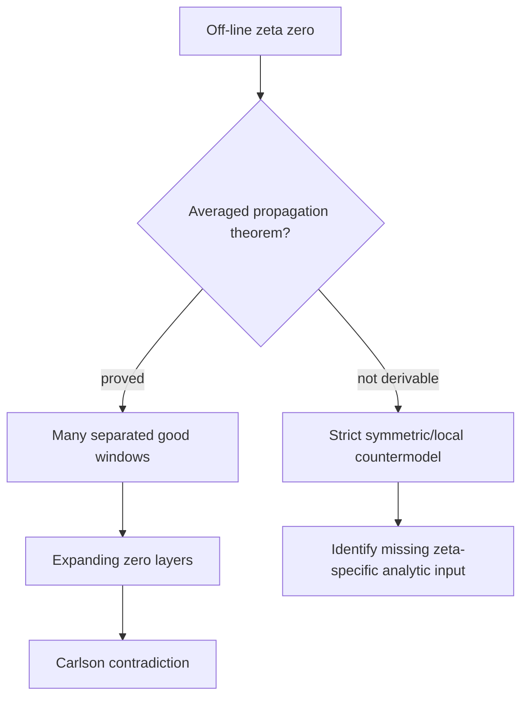

# Exceptional Zero Amplification Integration Design

## Goal

Integrate the existing half-isolated, zero-density amplification, and VK-edge
research chains into one focused Lean package, then test the only remaining
mathematical bridge:

```text
one off-critical-line zeta zero
  -> detector mass in many separated height windows
  -> quantitatively expanding zero clusters
  -> a Carlson zero-density contradiction.
```

The integration is successful when the downstream implication is represented
by concrete theorems and the upstream propagation question has either:

1. a theorem derived from existing zeta-specific analytic inputs, or
2. a strict countermodel/no-go theorem showing that the available inputs do
   not imply propagation.

An interface, `Prop`, structure field, class, audit document, or newly assumed
propagation hypothesis does not count as closing the mathematical bridge.

## Non-goals

- Do not claim a proof of the Riemann Hypothesis.
- Do not treat a conditional propagation theorem as unconditional.
- Do not improve the Guth-Maynard density exponent in this project.
- Do not add another abstract branching hierarchy unless it is instantiated
  from existing zeta theorems.
- Do not run aggregate repository builds or concurrent Lean builds.

## Isolated Workspace

All work is performed serially in:

```text
.worktrees/exceptional-zero-amplification-integration
```

on:

```text
research/exceptional-zero-amplification-integration
```

The source research branches remain unchanged.

## Existing Inputs

### Half-isolated endpoint

Source branch:

```text
research/half-isolated-zero-dichotomy
```

Required declarations include:

- `halfIsolatedDetectorClusterEndpoint`
- `halfIsolatedClusterIteration_exponential`
- `halfIsolatedLoopIteration_counterexample`
- `halfIsolatedDirectedIteration_exponential`
- `halfIsolatedOneStepAdvanceFromEndpoint`
- `halfIsolatedDirectedIteration_stall_under_equal_im_topLayer`

The last theorem is the formal obstruction: the current local endpoint permits
an equal-height two-point configuration whose directed iteration stalls.

### Density amplification endpoint

Source branch:

```text
research/zero-density-amplification-audit
```

Required declarations include:

- `iterativeWindowLayer_qpow_lowerBound`
- `sharedNeighborModel_not_exponential`
- `iterativeWindowLayer_qpow_lowerBound_with_subcertificate`
- `iterativeWindowLayer_to_carlson_contradiction`

This package consumes a genuine expanding layered certificate. It does not
produce that certificate from a zeta zero.

### VK/zeta endpoint

Source branch:

```text
research/vk-edge-conditional-package
```

Required declarations include:

- `equalRealPartZeroPackage_mono`
- `equalRealPartZeroPackage_symmetry_orbit`
- `halfIsolatedDirectedGrowth_witness_not_old_window`
- `halfIsolatedDirectedGrowthPotential_blocked_by_symmetry`
- `halfIsolatedDirectedGrowth_no_new_from_zeta_symmetry`
- `clustered_spectralLower_from_gap`
- `halfIsolatedEnvelopeBridge`
- `clusteredEnvelopeBridge`

The existing symmetry and monotonicity theorems preserve old zeros but do not
generate a zero at a new height.

## Architecture

### 1. Integration layer

Create:

```text
PrimeNumberTheorem/ExceptionalZeroAmplificationIntegration.lean
```

This module imports the three research packages and states concrete adapter
theorems connecting:

```text
directed expanding zero layers
  -> iterative window certificates
  -> Carlson contradiction.
```

Every adapter must be proved from imported declarations. No new analytic
assumption may be hidden inside a class or structure.

### 2. Experiment layer

Create:

```text
PrimeNumberTheorem/ExceptionalZeroAmplificationExperiment.lean
```

The preferred experiment replaces pointwise offspring with averaged
propagation. It searches the existing repository for a concrete shifted
detector or Dirichlet-polynomial mean-square quantity and attempts to prove:

```text
one off-line zero
  -> detector lower mass over a height range
  -> many separated good windows.
```

The experiment must use existing zeta, explicit-formula, Euler-product, or
Dirichlet-polynomial theorems. A definition named
`AveragedDetectorPropagation` without a proof from those inputs is only a
target and is not a result.

### 3. No-go layer

If averaged propagation cannot be derived, create:

```text
PrimeNumberTheorem/ExceptionalZeroAmplificationNoGo.lean
```

The no-go result must instantiate a finite or symmetric zero-package model
that satisfies the currently used local, symmetry, monotonicity, and
combinatorial premises while propagation fails. It must prove a negated
conclusion, not merely document that a proof was not found.

The intended conclusion is that symmetry, window monotonicity, local cluster
existence, and total zero counting are insufficient without an additional
zeta-specific analytic input such as an Euler-product correlation or an
averaged detector lower bound.

### 4. Evidence layer

Create:

```text
PrimeNumberTheorem/ExceptionalZeroAmplificationContract.lean
PrimeNumberTheorem/ExceptionalZeroAmplificationAxiomAudit.lean
docs/research/exceptional-zero-amplification-audit.md
```

The contract imports and applies the concrete integration theorem. The axiom
audit prints the axioms of the integration endpoint and the positive or no-go
experiment endpoint. The audit document records exact commands, outputs,
commits, conditional inputs, and the remaining bridge.

## Data Flow



The positive and no-go branches are mutually exclusive completion paths for
the experiment. Neither path may be replaced by a new assumed field.

## Validation

Validation is serial and focused:

1. Build only the integration module and its direct contract/audit modules.
2. Run `#print axioms` for every exported endpoint.
3. Scan owned files for `sorry`, `admit`, and new `axiom` declarations.
4. Confirm the integration worktree is clean after each committed checkpoint.
5. Record conditional hypotheses explicitly.

At most one `lake` process may run. A passing focused build establishes Lean
compilation only; it does not establish that the upstream propagation theorem
has been proved.

## Stage Gates

### Gate A: Source integration

The three source packages are available in the integration branch and their
focused contracts compile.

### Gate B: Concrete downstream composition

A proved theorem converts a genuine directed-expansion certificate into the
existing Carlson contradiction endpoint.

### Gate C: Analytic experiment

Exactly one of the following is required:

- a proved averaged propagation theorem derived from existing zeta-specific
  analytic inputs; or
- a strict no-go theorem instantiated by an explicit model.

### Gate D: Honest conclusion

The final audit distinguishes:

- imported formal results;
- newly proved adapter results;
- positive or negative analytic-experiment results;
- the exact unproved statement, if any.

Passing Gates A and B alone is integration progress, not mathematical closure.

## Resource Policy

- Maximum active research task count: one.
- Maximum simultaneous Lean build count: one.
- No aggregate `lake build`.
- No background task may restart another branch.
- Each stage stops after its focused commit and reports before the next stage
  starts.
